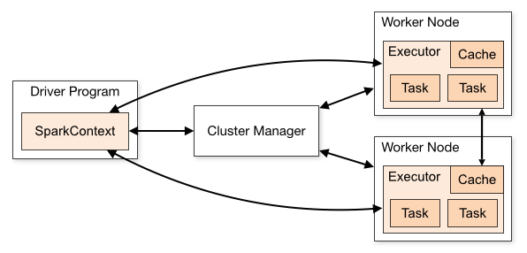

##基于Mesos运行Spark
 
###背景介绍
&nbsp;&nbsp;&nbsp;&nbsp;&nbsp;&nbsp;Spark有多种集群运行模式，例如：Standalone,Yarn,Mesos。 
&nbsp;&nbsp;&nbsp;&nbsp;&nbsp;&nbsp;下面就说一下如何在Mesos上运行Spark，这也是官方推荐的一种运行方式。 
&nbsp;&nbsp;&nbsp;&nbsp;&nbsp;&nbsp;在运行Spark之前咱们先简略介绍一下Mesos。 
&nbsp;&nbsp;&nbsp;&nbsp;&nbsp;&nbsp;Mesos计算框架是一个集群管理器，提供了有效的、跨分布式的应用或框架的资源隔离和共享，可以运行Haoop,Spark,Marathon等多种框架。使用Zookeeper实现容错机制，使用Linux&nbsp;Containers来隔离任务，支持多种资源计算分配，基于Mesos我们可以实现多种服务混布，更细粒度、更高效的提高资源利用率，避免资源的浪费。
 
&nbsp;&nbsp;&nbsp;&nbsp;&nbsp;&nbsp;关于Mesos的安装详细信息这里不再赘述，详情可以查看<http://get.dataman.io>。 
&nbsp;&nbsp;&nbsp;&nbsp;&nbsp;&nbsp;下图是Spark集群的工作模式，当我们使用Mesos的时候Mesos&nbsp;&nbsp;Master将替换Spark&nbsp;&nbsp;Master成为集群管理器。
 

 
**环境以Ubuntu&nbsp;14.04为例**
 
#####1.准备工作
&nbsp;&nbsp;&nbsp;&nbsp;(1)安装JDK&nbsp;&nbsp;1.7 
&nbsp;&nbsp;&nbsp;&nbsp;(2)安装Scala&nbsp;&nbsp;2.11 
&nbsp;&nbsp;&nbsp;&nbsp;(3)安装libcurl4-nss-dev&nbsp;&nbsp;&nbsp;&nbsp;（注：这是我自己安装过程遇到的一个错误） 
&nbsp;&nbsp;&nbsp;&nbsp;(4)下载Spark二进制包<http://spark.apache.org/downloads.html> 
&nbsp;&nbsp;&nbsp;&nbsp;(5)Spark Driver可以安装在任意机器上，如果安装Spark Driver的已经安装了Mesos，可以找到/usr/local/lib/libmesos.so&nbsp;&nbsp;这是Spark Driver需要加载的Mesos的库，如果机器上没有安装Mesos可以从安装Mesos的机器上复制过来。
 
#####2.配置Spark&nbsp;&nbsp;Driver
&nbsp;&nbsp;&nbsp;&nbsp;(1)下载Spark二进制包&nbsp;&nbsp;&nbsp;&nbsp;<pre><code>wget http://mirror.reverse.net/pub/apache/spark/spark-1.4.0/spark-1.4.0-bin-hadoop2.6.tgz</code></pre>

&nbsp;&nbsp;&nbsp;&nbsp;(2)解压<pre><code>tar -zxf spark-1.4.0-bin-hadoop2.6.tgz</code></pre>

&nbsp;&nbsp;&nbsp;&nbsp;(3)进入目录<pre><code>cd spark-1.4.0-bin-hadoop</code></pre>

&nbsp;&nbsp;&nbsp;&nbsp;(4)复制配置文件<pre><code>cp conf/spark-defaults.conf.template conf/spark-defaults.conf && cp conf/spark-env.sh.template conf/spark-env.sh</code></pre>

&nbsp;&nbsp;&nbsp;&nbsp;(5)修改spark-env.sh配置选项，我主要修改了如下配置
<pre><code>export MESOS_NATIVE_JAVA_LIBRARY=/usr/local/lib/libmesos.so     #加载Mesos库的路径

export MASTER=mesos://zk://192.168.100.7:2181,192.168.100.8:2181,192.168.100.9:2181/mesos     #如果是单主节点可以用mesos://ip:host，如果是用zookeeper管理的多主节点就需要mesos://zk://192.168.100.7:2181,192.168.100.8:2181,192.168.100.9:2181/mesos 

export SPARK_LOCAL_IP=`ifconfig eth0 | awk '/inet addr/{print substr($2,6)}'` 

export SPARK_LOCAL_HOSTNAME=`ifconfig eth0 | awk '/inet addr/{print substr($2,6)}'` 

export JAVA_HOME=$(readlink -f /usr/bin/java | sed "s:jre/bin/java::")

export SPARK_EXECUTOR_URI=&lt;URL of spark-1.4.0.tar.gz uploaded above&gt;    #这个是spark二进制包所在的位置，当mesos在计算节点运行任务的时候，计算节点必须有spark的二进制包来建立spark的运行环境。</code></pre>

&nbsp;&nbsp;&nbsp;&nbsp;(6)运行spark-shell&nbsp;&nbsp;&nbsp;&nbsp;现在Spark Driver的配置基本已经配置完了，我们可以运行bin目录下的spark-shell，当运行成功以后查看Mesos的Web页面Active Frameworks如果出来如下图所示的进程，就表示我们已经配置成功了。

 
现在我们就可以编写属于我们自己的Spark程序了。
